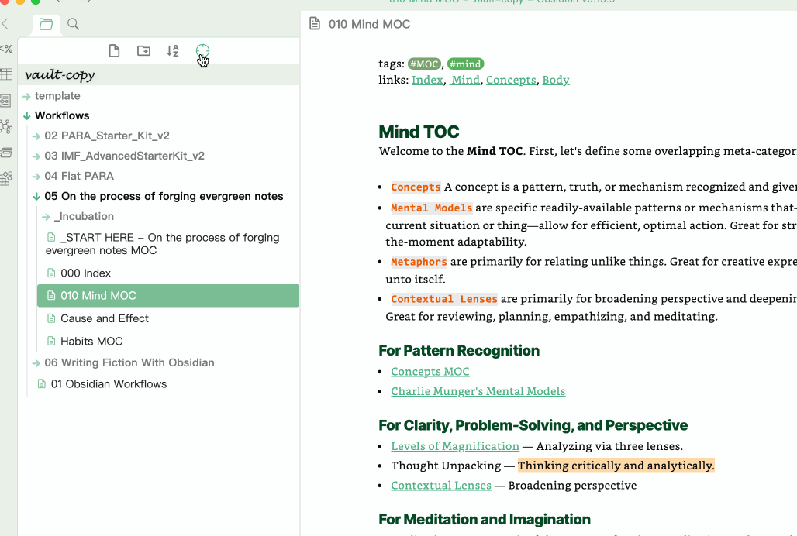

# Obsidian Reveal File In Navigation

This plugin provides a button to locate the currently active file in the side navigation.

obsidian自带的"在文件列表中显示当前文件"按钮有些隐蔽。 这里在目录顶部添加了一个按钮,便于定位当前文件。

# license

MIT

